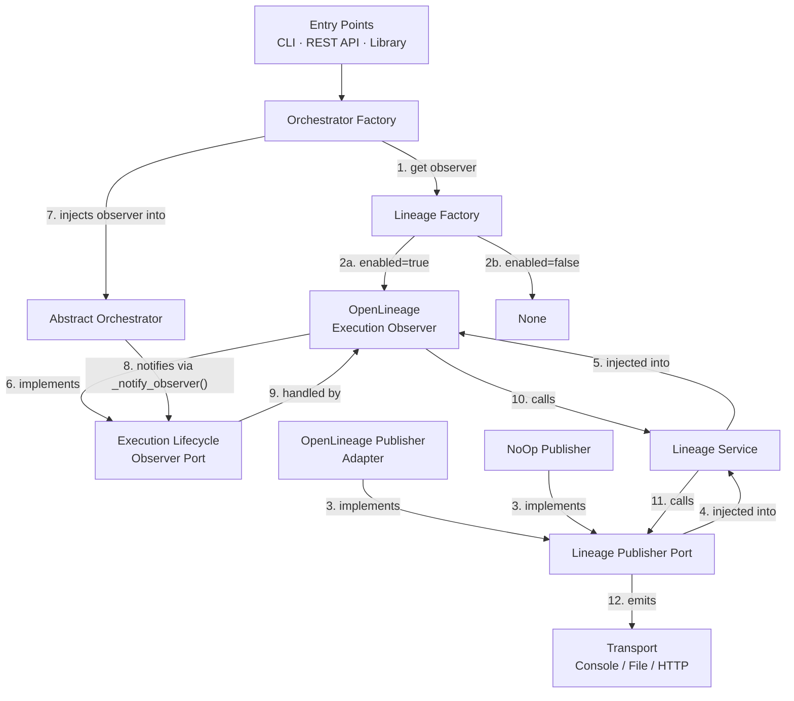
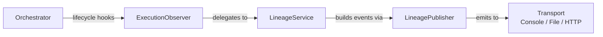
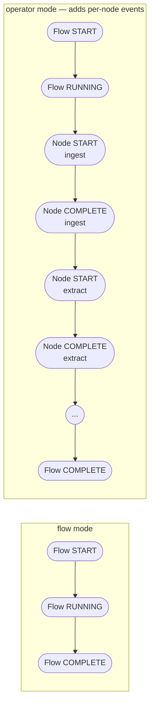
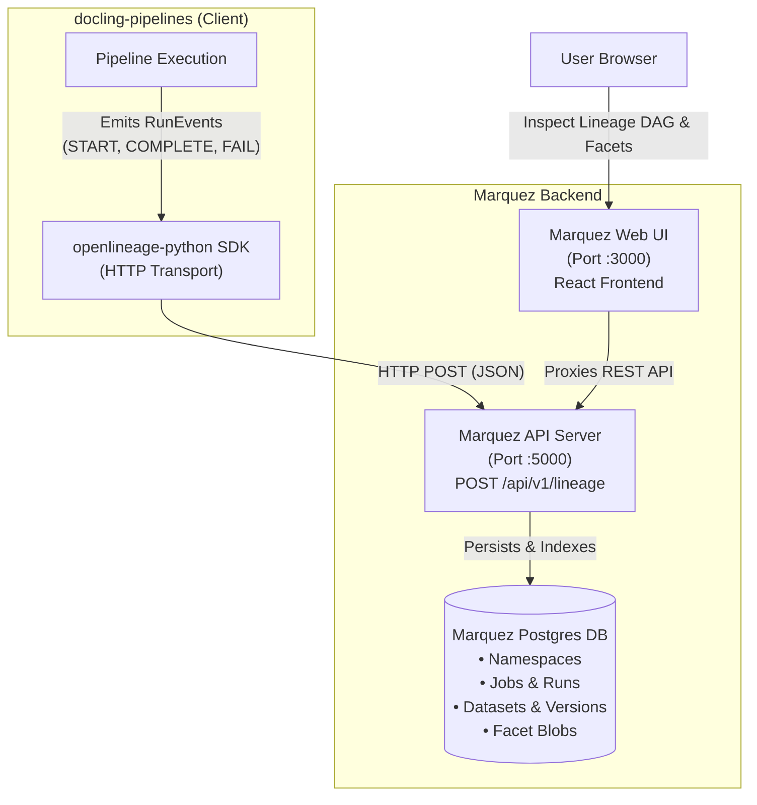

# OpenLineage Integration Guide

Data lineage support for docling-pipelines via the [OpenLineage](https://openlineage.io) standard.

## Table of Contents

1. [Overview](#1-overview)
2. [Architecture](#2-architecture)
3. [How lineage works in docling-pipelines](#3-how-lineage-works-in-docling-pipelines)
4. [Installation and enabling](#4-installation-and-enabling)
5. [Configuration reference](#5-configuration-reference)
6. [Emission modes — flow vs operator](#6-emission-modes--flow-vs-operator)
7. [Viewing lineage events](#7-viewing-lineage-events)
8. [What gets emitted](#8-what-gets-emitted)
9. [Custom facets reference](#9-custom-facets-reference)
10. [Adding a custom lineage client](#10-adding-a-custom-lineage-client)

---

## 1. Overview

Data lineage tracks where data originates, what systems touch it, and how it is transformed along the way. For document processing pipelines this means recording the source of ingested documents, which operators processed them, and what the final output contained — creating an auditable, queryable record of every pipeline run.

[OpenLineage](https://openlineage.io) is an open, vendor-neutral specification for capturing lineage metadata. Any backend that implements the OpenLineage API can consume events from docling-pipelines without integration changes.

Docling-pipelines emits OpenLineage run events at two levels of detail: a single flow-level event sequence that summarises the entire pipeline run, and (optionally) per-operator events that capture the input and output of each individual DAG node. The feature is opt-in — no lineage events are emitted unless explicitly enabled, and there is zero performance overhead when it is disabled.

---

## 2. Architecture

The lineage system follows a hexagonal architecture with three distinct layers, each responsible for one concern.



**Observer** (`ExecutionLifecycleObserverPort` / `OpenLineageExecutionObserver`) — controls *when* events are fired. It receives execution context objects from the orchestrator and decides which events to emit based on the configured mode.

**Service** (`LineageService`) — controls *what* each event contains. It translates execution context objects into the neutral domain models (`LineageRun`, `LineageJob`, `LineageDataset`) and builds all standard and custom facets. It has no knowledge of any specific backend or transport.

**Publisher** (`LineagePublisherPort` / `OpenLineagePublisherAdapter`) — controls *where* events go. It receives the neutral domain models and maps them to the target backend's wire format. The `OpenLineagePublisherAdapter` delegates entirely to the `openlineage-python` SDK, which handles transport based on environment configuration. The `NoOpLineagePublisherAdapter` discards all events silently — used as a fallback when `openlineage-python` fails to initialise, or as a development aid.

---

## 3. How lineage works in docling-pipelines

When lineage is enabled, the orchestrator calls lifecycle hooks at key execution milestones. An observer translates those hooks into OpenLineage run events using a neutral service layer, and a publisher sends the events to the configured transport.



### Two-level lineage model

Every pipeline run produces a **flow job** in the lineage graph — a single job named after the flow that represents the entire run from ingest to final output. In operator mode, each DAG node additionally produces its own **operator job** that is a child of the flow job, exposing per-operator inputs, outputs, and statistics.

### Dataset stitching

Lineage graphs are built from dataset edges. The output dataset name of one node matches the input dataset name of the next downstream node, which is how the lineage backend draws edges between operator jobs. Ingest nodes receive a dataset name derived from the source provider and path (for example `filesystem://./my-docs` or `s3://my-bucket`) so the graph shows the actual data origin.

### Credential safety

Flow definitions are never sent to the lineage backend as-is. Before any facet is built, the service strips all credential keys (`api_key`, `apikey`, `secret`, `secret_key`, `password`, `token`, `auth_token`, `access_token`, `credentials`, `connection_params`) from the flow definition — including keys nested inside the DAG node list. Operator output metadata passed into `docpipeStats` facets is filtered with the same credential key set before emission.

---

## 4. Installation and enabling

### 4.1 Install the lineage extra

The OpenLineage integration is an optional dependency. Install it alongside docling-pipelines using the `lineage` extra:

```bash
pip install "docling-pipelines[lineage]"
```

Or, when working from source with `uv`:

```bash
uv pip install -e ".[lineage]"
```

This installs `openlineage-python==1.52.0`.

Verify the installation:

```bash
python -c "from openlineage.client import OpenLineageClient; print('ok')"
```

> [!NOTE]
> If lineage is enabled but `openlineage-python` is not installed, docpipe logs a one-time WARNING
> at startup and falls back to a no-op publisher that silently discards all events. The pipeline
> continues to run normally.

### 4.2 Enable lineage

Lineage emission is **disabled by default**. Nothing is emitted without explicitly setting `DOCPIPE_LINEAGE_ENABLED=true`.

The minimum configuration to activate lineage is:

```bash
export DOCPIPE_LINEAGE_ENABLED=true
# Optional: set a transport (defaults to console if omitted)
export OPENLINEAGE__TRANSPORT__TYPE=console

docling-pipelines --flow-file my_flow.json
```

The same environment variables work when using the Python library:

```python
import os

os.environ["DOCPIPE_LINEAGE_ENABLED"] = "true"
os.environ["OPENLINEAGE__TRANSPORT__TYPE"] = "console"

from docpipe.lib.docpipe_flow_manager import DocpipeFlowManager

DocpipeFlowManager(flow_file="my_flow.json").execute()
```

> [!TIP]
> If `OPENLINEAGE__TRANSPORT__TYPE` is not set, the SDK defaults to `ConsoleTransport` and prints
> events to stdout. This is a safe starting point — enable lineage and run a flow to see the exact
> event structure before configuring a backend.

---

## 5. Configuration reference

### 5.1 Docpipe lineage environment variables

| Variable | Default | Description |
| --- | --- | --- |
| `DOCPIPE_LINEAGE_ENABLED` | `false` | Master switch. Must be `true` to activate emission. |
| `DOCPIPE_LINEAGE_MODE` | `flow` | `flow` or `operator`. Controls event granularity — see [Section 6](#6-emission-modes--flow-vs-operator). |
| `DOCPIPE_LINEAGE_NAMESPACE` | `docpipe://local` | OpenLineage namespace for all jobs and datasets. Use a stable, environment-specific value in shared deployments. |
| `DOCPIPE_LINEAGE_PRODUCER` | `https://github.com/IBM/docling-pipelines` | Producer URI embedded in all facets. Identifies the system that generated events. |
| `DOCPIPE_LINEAGE_STRICT` | `false` | When `true`, observer exceptions are re-raised and halt the pipeline. Default `false` — exceptions are logged as warnings and execution continues. |

### 5.2 OpenLineage SDK transport configuration

Once `DOCPIPE_LINEAGE_ENABLED=true`, docpipe creates an `OpenLineageClient()` with no transport arguments. The SDK resolves transport entirely from its own environment variables (prefixed `OPENLINEAGE__`) or from an `openlineage.yml` config file in the working directory or `~/.openlineage/`. Docpipe does not intercept or wrap these variables.

Full SDK configuration reference: [openlineage.io/docs/client/python/configuration](https://openlineage.io/docs/client/python/configuration)

### Supported transport types

The following transports are available with `openlineage-python==1.52.0` and are supported for use with docling-pipelines:

| Type | Description |
| --- | --- |
| `http` | Synchronous HTTP POST to any OpenLineage-compatible backend (Marquez or other compatible platforms). The primary transport for production use. |
| `file` | Write events to a local JSONL file. Recommended for testing, audit trails, and offline inspection — see [Section 5.4](#54-file-transport) for full configuration. |
| `console` | Print events to stdout via the Python logger. Zero configuration — the recommended transport for local development and debugging. |

### 5.3 HTTP transport quick reference

Legacy shorthand (also supported for backwards compatibility):

| Variable | Description |
| --- | --- |
| `OPENLINEAGE_URL` | Backend URL, e.g. `http://localhost:5000`. Required for HTTP transport. |
| `OPENLINEAGE_API_KEY` | Bearer token for authenticated backends. Optional. |
| `OPENLINEAGE_ENDPOINT` | API path. Default: `api/v1/lineage`. |

Modern form using the `OPENLINEAGE__` prefix:

| Variable | Default | Description |
| --- | --- | --- |
| `OPENLINEAGE__TRANSPORT__TYPE` | — | Must be `http`. |
| `OPENLINEAGE__TRANSPORT__URL` | — | Base URL of the backend. Required. |
| `OPENLINEAGE__TRANSPORT__ENDPOINT` | `api/v1/lineage` | API path appended to URL. |
| `OPENLINEAGE__TRANSPORT__AUTH__TYPE` | — | `api_key` or `jwt`. |
| `OPENLINEAGE__TRANSPORT__AUTH__APIKEY` | — | Bearer token when `type=api_key`. |
| `OPENLINEAGE__TRANSPORT__COMPRESSION` | — | `gzip` to compress the request body. |
| `OPENLINEAGE__TRANSPORT__TIMEOUT` | `5` | Connection timeout in seconds. |

### 5.4 File transport

The file transport writes each lineage event as a JSON object to a local file. It is the recommended transport when you want to inspect the exact events docpipe emits, run integration tests offline, or maintain a local audit log without standing up a backend.

| Variable | Default | Description |
| --- | --- | --- |
| `OPENLINEAGE__TRANSPORT__TYPE` | — | Must be `file`. |
| `OPENLINEAGE__TRANSPORT__LOG_FILE_PATH` | — | Path to the output file. Required. Example: `/tmp/lineage/events.jsonl`. |
| `OPENLINEAGE__TRANSPORT__APPEND` | `false` | If `true`, all events are appended to one file separated by newlines. If `false`, each event is written to a separate timestamped file named `{path}-{datetime}`. |

**Example — append all events to a single JSONL file:**

```bash
mkdir -p /tmp/lineage
export DOCPIPE_LINEAGE_ENABLED=true
export OPENLINEAGE__TRANSPORT__TYPE=file
export OPENLINEAGE__TRANSPORT__LOG_FILE_PATH=/tmp/lineage/events.jsonl
export OPENLINEAGE__TRANSPORT__APPEND=true

docling-pipelines --flow-file my_flow.json
```

> [!TIP]
> Each line in the resulting `.jsonl` file is a complete JSON event. Pipe it through `jq` to inspect
> individual events and verify facets and dataset names before connecting a live backend:
>
> ```bash
> cat /tmp/lineage/events.jsonl | jq '.eventType, .job.name'
> ```

---

## 6. Emission modes — flow vs operator

| | Flow mode | Operator mode |
| --- | --- | --- |
| **Set via** | `DOCPIPE_LINEAGE_MODE=flow` (default) | `DOCPIPE_LINEAGE_MODE=operator` |
| **Flow-level events** | Yes | Yes |
| **Per-node events** | No | Yes — one child run per DAG node |
| **Event volume** | Low | Higher — proportional to node count |
| **Best for** | Production monitoring, dashboards | Debugging, per-operator audit, data quality investigation |

**Flow mode** emits a single job per pipeline run: a START when the pipeline begins, a RUNNING after ingest completes, and a COMPLETE, FAIL, or ABORT when the run ends. The flow job carries the ingest source as its input dataset and the terminal output table(s) as its output datasets.

**Operator mode** emits all the same flow-level events, and additionally emits a START, COMPLETE, FAIL, or SKIP event for each individual DAG node. Each node run is linked back to the flow run via a `parent` run facet, so backends display operator runs nested inside their parent flow run rather than as independent jobs.



> [!TIP]
> Start with `flow` mode. Switch to `operator` mode when you need to identify which specific node
> affected document counts or introduced a data quality issue.

---

## 7. Viewing lineage events

### 7.1 Console transport — no backend required

Set `OPENLINEAGE__TRANSPORT__TYPE=console` (or omit the transport setting entirely). Events are logged to stdout at INFO level via the Python logger. This is the fastest way to verify that lineage events are being generated correctly.

### 7.2 File transport — offline inspection

Configure the file transport (see [Section 5.4](#54-file-transport)) to write events to a local JSONL file. Open the file in any JSON viewer or use `jq` to inspect individual events without connecting a backend.

### 7.3 Marquez integration and visualization

[Marquez](https://marquezproject.ai) is the open-source reference implementation of the OpenLineage standard (hosted by the Linux Foundation). While OpenLineage defines the metadata specification, Marquez provides the centralized metadata repository, graph stitching engine, and interactive Web UI.

#### Key Marquez concepts

Before viewing lineage in Marquez, understand how its data model aligns with `docling-pipelines`:

* **Namespaces**: Logical context boundaries for jobs and datasets (e.g. `docpipe://dev`, `docpipe://stage`, `docpipe://prod`).
* **Jobs**: The transformation code that executed. In **flow mode**, this is the pipeline flow name (e.g. `customer_support_rag`). In **operator mode**, each DAG node also becomes a distinct child job (e.g. `extract_operator`, `chunker`, `embeddings`).
* **Runs**: A single execution instance of a job identified by a UUID. Runs transition through lifecycle states: `START` &rarr; `RUNNING` &rarr; `COMPLETE` or `FAIL`.
* **Datasets & Graph Stitching**: Data inputs and outputs identified by unique URIs (e.g. `filesystem://./docs`, `opensearch://knowledge_base`). Marquez automatically stitches DAG edges whenever Job A's output dataset matches Job B's input dataset.
* **Facets**: Metadata payloads attached to runs, jobs, and datasets, such as dynamic PyArrow schema definitions, execution times, document processing metrics (`docpipeStats`), and error stack traces.

#### Architecture and data flow

`docling-pipelines` interacts with Marquez via the standard `openlineage-python` SDK over HTTP:



#### Setting up Marquez locally

Start the Marquez API, Web UI, and PostgreSQL database locally using Docker Compose:

```bash
git clone https://github.com/MarquezProject/marquez.git
cd marquez
./docker/up.sh
```

Once started:
* **Marquez Web UI**: `http://localhost:3000`
* **Marquez API Server**: `http://localhost:5000`

#### Marquez transport configuration

To direct the `openlineage-python` SDK to your Marquez API endpoint, set the target URL:

```bash
export OPENLINEAGE_URL=http://localhost:5000
```

Alternatively, when using structured transport variables:

```bash
export OPENLINEAGE__TRANSPORT__TYPE=http
export OPENLINEAGE__TRANSPORT__URL=http://localhost:5000
```

#### Viewing events in the Marquez UI

Once the setup is running and pipelines execute, navigating to `http://localhost:3000` provides full visibility into the emitted events:

1. **Namespace Selection**: Choose your configured namespace (e.g. `docpipe://dev`) from the top-left dropdown.
2. **Lineage Graph**: Select any pipeline job under the **Jobs** tab to view the stitched dataset-to-job DAG.
3. **Schema Inspection**: Click on any input/output dataset node to inspect the dynamically inferred PyArrow column names and data types.
4. **Execution Status & Metrics**: Click on any run to inspect execution timestamps, lifecycle status badges (`COMPLETE` in green, `FAIL` in red), and custom facets including **`docpipeStats`** and **`docpipeFlow`**.

### 7.4 Other OpenLineage-compatible backends

Because `docling-pipelines` standardizes on OpenLineage, any backend implementing the OpenLineage HTTP API (such as DataHub, Atlan, Collibra, or Egeria) can consume events by setting `OPENLINEAGE_URL` to its endpoint. For a full list of compatible platforms see [openlineage.io/ecosystem](https://openlineage.io/ecosystem).

---

## 8. What gets emitted

### 8.1 Flow mode events

These events are emitted in both `flow` and `operator` mode.

| Event | Trigger | Key facets |
| --- | --- | --- |
| **Flow START** | Pipeline execution begins | `jobType` (FLOW/BATCH), `documentation`, `docpipeFlowId`, `docpipeOperators` (operator list + count, added on START only); `nominalTime` only when `start_time` is provided |
| **Flow RUNNING** | Ingest stage completes; active processing begins | Input dataset: ingest source name with row count and column schema |
| **Flow COMPLETE** | Pipeline finishes successfully | Output dataset(s) with schema and row count; `docpipeStats` (`totalDocs`, `completedDocs`, `failedDocs`, `skippedDocs`) — only present when at least one document was processed |
| **Flow FAIL** | Pipeline terminates with an error | `errorMessage` facet with message only; `stackTrace` is never included (orchestrator does not pass an exception object to the flow fail context) |
| **Flow ABORT** | Pipeline is cancelled or stopped | End timestamp (start time is not passed by the orchestrator and will be absent) |

### 8.2 Operator mode — additional events per DAG node

When `DOCPIPE_LINEAGE_MODE=operator`, all five flow-level events above are still emitted. Additionally, each DAG node emits its own child run events linked back to the parent flow run via the `parent` run facet.

| Event | Trigger | Key facets |
| --- | --- | --- |
| **Node START** | A DAG node begins execution | `jobType` (OPERATOR/BATCH) with operator `short_name`; `operatorCategory` is not populated on START (not passed by the orchestrator); `parent` run facet; input dataset from predecessor node's output (only present when previous step produced a table) |
| **Node COMPLETE** | A DAG node finishes successfully | Output dataset(s) with schema and row count; `docpipeStats` with operator-specific camelCase metrics (e.g. `totalChunks`, `docsBeforeFilter`, `chunksIndexedSuccessfully`); `parent` run facet |
| **Node FAIL** | A DAG node throws an exception | `errorMessage` with message and full Python stack trace (`Traceback (most recent call last): ...`); `parent` run facet; input dataset if available |
| **Node SKIP (OTHER)** | A DAG node is skipped | `docpipeSkip.reason` explaining why the node was skipped; `parent` run facet |

> [!TIP]
> Ingest node input datasets are named from the source provider and path — for example
> `filesystem://./my-docs` or `s3://my-bucket` — so the lineage graph shows the actual data origin
> rather than an opaque internal identifier.

---

## 9. Custom facets reference

Docpipe attaches the following custom facets to events in addition to the standard OpenLineage facets.

| Facet | Attaches to | Fields | Description |
| --- | --- | --- | --- |
| `docpipeFlowId` | Job (flow) | `flowId` | The flow's asset ID, or a SHA-256 hash of the credentials-stripped flow definition if no asset ID is set. Only attached when a flow definition is available (START and COMPLETE events). |
| `docpipeOperators` | Job (flow) | `operators` (list), `count` | The list of operator `short_name` values present in the flow. Added on Flow START only, and only when the operator list is non-empty. |
| `docpipeStats` (flow) | Run — Flow COMPLETE | `totalDocs`, `completedDocs`, `failedDocs`, `skippedDocs` | Aggregated document counts for the entire pipeline run. Only present when at least one document was processed. |
| `docpipeStats` (node) | Run — Node COMPLETE | operator-specific scalars | All scalar values from the operator's output metadata, converted from `snake_case` to `camelCase` (e.g. `totalChunks`, `docsBeforeFilter`). The four flow-level fields are not included. Only present when the metadata dict contains at least one scalar value. |
| `docpipeSkip` | Run (OTHER) | `reason` | The reason a node was skipped. Present only on Node SKIP (OTHER) events. |

---

## 10. Adding a custom lineage client

You can send lineage events to any backend by implementing a custom publisher. The integration is designed around two port interfaces — you only need to implement the one that matches your use case.

### 10.1 Understanding the two ports

**`LineagePublisherPort`** controls what to send and where. It receives neutral domain models (`LineageRun`, `LineageJob`, `LineageDataset`) that contain only plain Python types — no PyArrow tables, no docpipe internals. This is the correct extension point for almost all custom backends.

**`ExecutionLifecycleObserverPort`** controls when hooks fire. The existing `OpenLineageExecutionObserver` already implements this and delegates to `LineageService`. Only override this port if you need to change event timing or payload shaping logic — not just the transport.

### 10.2 Implementing LineagePublisherPort

Create a class that extends [`LineagePublisherPort`](../../../src/docpipe/core/lineage/domain/ports/lineage_publisher.py) and implement the single `publish()` method:

```python
from docpipe.core.lineage.domain.models.dataset import LineageDataset
from docpipe.core.lineage.domain.models.event_type import LineageEventType
from docpipe.core.lineage.domain.models.job import LineageJob
from docpipe.core.lineage.domain.models.run import LineageRun
from docpipe.core.lineage.domain.ports.lineage_publisher import LineagePublisherPort
from docpipe.utils.infrastructure.logging import get_logger

logger = get_logger()


class MyCustomPublisher(LineagePublisherPort):
    """Sends lineage events to a custom REST endpoint."""

    def __init__(self, *, endpoint_url: str) -> None:
        self._url = endpoint_url

    def publish(
        self,
        *,
        event_type: LineageEventType,
        run: LineageRun,
        job: LineageJob,
        inputs: list[LineageDataset] | None = None,
        outputs: list[LineageDataset] | None = None,
    ) -> None:
        import requests

        payload = {
            "eventType": str(event_type),
            "runId": run.run_id,
            "jobName": job.name,
            "jobNamespace": job.namespace,
            "inputs": [{"name": d.name, "namespace": d.namespace} for d in (inputs or [])],
            "outputs": [{"name": d.name, "namespace": d.namespace} for d in (outputs or [])],
        }
        try:
            requests.post(self._url, json=payload, timeout=5)
        except Exception as exc:
            logger.warning("Failed to emit lineage event to %s: %s", self._url, exc)
```

### 10.3 Domain model quick reference

| Model | Field | Type | Description |
| --- | --- | --- | --- |
| `LineageRun` | `run_id` | `str` | UUID for this run |
| | `facets` | `dict` | Run-level facets |
| | `start_time` | `str \| datetime \| None` | ISO-8601 start timestamp |
| | `end_time` | `str \| datetime \| None` | ISO-8601 end timestamp |
| | `status` | `str \| None` | Execution status string (e.g. `"Completed"`, `"Failed"`) |
| `LineageJob` | `namespace` | `str` | OpenLineage namespace |
| | `name` | `str` | Job name, e.g. `my-flow` or `my-flow/chunker` |
| | `facets` | `dict` | Job-level facets |
| `LineageDataset` | `namespace` | `str` | OpenLineage namespace |
| | `name` | `str` | Dataset path-style name |
| | `facets` | `dict` | Schema and statistics facets |

### 10.4 Wiring the custom publisher

[`lineage_factory.py`](../../../src/docpipe/core/lineage/application/lineage_factory.py) is the single wiring point where the publisher is created and injected into `LineageService`. Replace the `OpenLineagePublisherAdapter` instantiation with your own:

```python
# In src/docpipe/core/lineage/application/lineage_factory.py

# Replace this:
publisher = OpenLineagePublisherAdapter()

# With this:
from my_package.my_publisher import MyCustomPublisher

publisher = MyCustomPublisher(endpoint_url="https://my-backend.example.com/lineage")
```

> [!NOTE]
> Modifying `lineage_factory.py` directly is the correct mechanism for internal use. If you need
> plugin-style publisher registration without modifying source files, open a feature request on the
> [issue tracker](https://github.com/IBM/docling-pipelines/issues).

### 10.5 Advanced: implementing ExecutionLifecycleObserverPort

If you need to change *when* an event fires — not just where it goes — implement
[`ExecutionLifecycleObserverPort`](../../../src/docpipe/core/lineage/domain/ports/execution_lifecycle_observer.py) directly. The port defines nine lifecycle hooks:

| Hook | When called |
| --- | --- |
| `on_flow_start` | Pipeline execution begins |
| `on_flow_running` | Ingest completes; active processing begins |
| `on_flow_complete` | Pipeline finishes successfully |
| `on_flow_fail` | Pipeline terminates with an error |
| `on_flow_abort` | Pipeline is cancelled |
| `on_node_start` | A DAG node begins execution |
| `on_node_complete` | A DAG node finishes successfully |
| `on_node_fail` | A DAG node throws an exception |
| `on_node_skip` | A DAG node is skipped |

> [!TIP]
> During development, pair a custom observer with
> [`NoOpLineagePublisherAdapter`](../../../src/docpipe/core/lineage/adapters/noop/publisher.py)
> to silence actual emission while you iterate on the observer logic.

