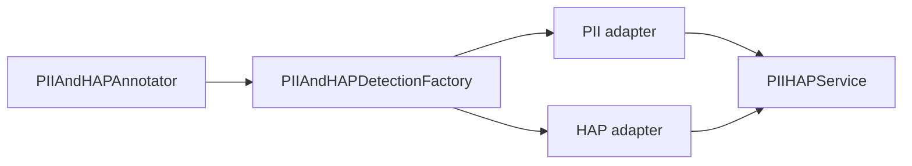

# PIIAndHAPAnnotator

Detects and optionally redacts Personally Identifiable Information (PII) and Hate, Abuse &
Profanity (HAP) content from document text.

- **Short Name:** `pii_and_hap`
- **Category:** Quality

---

## Overview

`PIIAndHAPAnnotator` scans each document's text content for PII (emails, phone numbers, credit
card numbers, etc.) and HAP language. PII and HAP detection are served by independently selectable
providers: multi-capability providers (LiteLLM, WatsonX) can serve both, while single-capability
providers serve one (Presidio detects PII only). Detected instances are counted in dedicated output
columns; when redaction is enabled the matched spans are replaced with a masking character in the
original content column.

---

## Key Features

- Independent provider per capability: `pii_provider` / `hap_provider`, each with its own config
- LLM-based detection via LiteLLM (100+ providers including Ollama) or the WatsonX native detection API
- Local, model-free PII detection via Microsoft Presidio (optional `presidio` extra)
- Legacy `provider` / `provider_config` shorthand still configures both capabilities at once
- Fail-fast validation: a provider that lacks a required capability is rejected before any document is processed
- Only the capabilities listed in `expected_redactions` are configured, validated and invoked
- Separate detection and redaction toggles, thresholds and masking characters for PII and HAP
- Selectable PII types to detect (13 built-in categories)
- Debug mode (`display_pii`) to surface detected values in output columns
- Graceful per-document error handling — failed documents are logged and skipped

---

## Operator Configuration

```json
{
  "type": "pii_and_hap",
  "name": "detect_pii_hap",
  "config": {
    "provider": "litellm",
    "provider_config": {
      "model_id": "openai/granite4",
      "api_base": "http://localhost:11434/v1",
      "api_key": "<ollama>"
    },
    "expected_redactions": ["pii", "hap"],
    "redaction": true,
    "hap_redaction": true,
    "pii_threshold": 0.5,
    "hap_threshold": 0.8
  },
  "depends_on": ["extract_documents"]
}
```

---

## Parameters

| Parameter | Type | Required | Default | Description |
|---|---|---|---|---|
| `provider` | string | No | `"litellm"` | Provider for every expected redaction without its own `pii_provider` / `hap_provider`: `litellm`, `watsonx` or `presidio` (PII only) |
| `provider_config` | object | No | `{}` | Config for `provider` (see below); also used by `pii_provider` / `hap_provider` when they name the same provider or `provider` is unset |
| `pii_provider` | string | No | — | Provider for PII detection; overrides `provider` for PII. Valid: `litellm`, `presidio`, `watsonx` |
| `pii_provider_config` | object | No | `{}` | Config for `pii_provider`. When empty, `provider_config` is used if `provider` is unset or equals `pii_provider` |
| `hap_provider` | string | No | — | Provider for HAP detection; overrides `provider` for HAP. Valid: `litellm`, `watsonx` |
| `hap_provider_config` | object | No | `{}` | Config for `hap_provider`. When empty, `provider_config` is used if `provider` is unset or equals `hap_provider` |
| `redaction` | boolean | Yes | `false` | Replace detected PII spans with `redaction_character` |
| `hap_redaction` | boolean | Yes | `false` | Replace detected HAP spans with `hap_redaction_character` |
| `expected_redactions` | list | No | `["pii","hap"]` | Detection types to run: any subset of `["pii","hap"]`. Only these capabilities need a provider |
| `pii_list` | list | No | all 13 types | PII types to detect (see supported types below) |
| `redaction_character` | string | No | `"*"` | Masking character for PII redaction |
| `hap_redaction_character` | string | No | `"*"` | Masking character for HAP redaction |
| `pii_threshold` | float | No | `0.5` | Confidence threshold for PII detection (0.0–1.0) |
| `hap_threshold` | float | No | `0.8` | Confidence threshold for HAP detection (0.0–1.0) |
| `display_pii` | boolean | No | `false` | Add extra columns with actual PII values (**testing only**) |

### Provider capabilities

| Provider | PII | HAP | Notes |
|---|---|---|---|
| `litellm` | Yes | Yes | Prompt-based detection through any LiteLLM-compatible endpoint (Ollama, vLLM, OpenAI, ...) |
| `watsonx` | Yes | Yes | WatsonX native `/ml/v1/text/detection` API |
| `presidio` | Yes | No | Local detection with Microsoft Presidio; needs `pip install "docling-pipelines[presidio]"` and a spaCy model |

Selecting a provider for a capability it does not support (for example `hap_provider: "presidio"`, or
`provider: "presidio"` while `expected_redactions` contains `hap`) is a validation error raised when the
operator is created, before any document is processed.

### LiteLLM `provider_config`

| Field | Type | Required | Description |
|---|---|---|---|
| `model_id` | string | Yes | Model ID with provider prefix (e.g. `openai/granite4` for Ollama) |
| `api_base` | string | No | API endpoint URL (e.g. `http://localhost:11434/v1` for Ollama) |
| `api_key` | string | No | Authentication key |

### WatsonX `provider_config`

| Field | Type | Required | Description |
|---|---|---|---|
| `model_id` | string | Yes | WatsonX model identifier |
| `api_key` | string | Yes | IBM Cloud API key |
| `url` | string | Yes | WatsonX endpoint URL |
| `container_kind` | string | Yes | `"project"` or `"space"` |
| `container_id` | string | Yes | Project or space UUID |
| `timeout` | integer | No | Request timeout in seconds (default: `300`) |

### Presidio `provider_config`

| Field | Type | Required | Description |
|---|---|---|---|
| `language` | string | No | Document language code passed to Presidio (default: `"en"`) |
| `spacy_model` | string | No | spaCy NER model (default: `"en_core_web_lg"`); install it with `python -m spacy download <model>` |
| `entity_mapping` | object | No | Presidio entity type to PII type overrides, merged over the built-in mapping (e.g. `{"DATE_TIME": "DateOfBirth"}`) |

Presidio entity types are mapped to the `pii_list` vocabulary as follows; unmapped entities are ignored:

| PII type | Presidio entity types |
|---|---|
| `EmailAddress` | `EMAIL_ADDRESS` |
| `PhoneNumber` | `PHONE_NUMBER` |
| `SocialSecurityNumber` | `US_SSN` |
| `CreditCardNumber` | `CREDIT_CARD` |
| `BankAccountNumber` | `US_BANK_NUMBER`, `IBAN_CODE` |
| `IPAddress` | `IP_ADDRESS` |
| `PersonName` | `PERSON` |
| `PassportNumber` | `US_PASSPORT`, `UK_PASSPORT`, `IT_PASSPORT` |
| `DriverLicenseNumber` | `US_DRIVER_LICENSE`, `IT_DRIVER_LICENSE` |
| `NationalID` | `US_ITIN`, `UK_NINO`, `ES_NIF`, `ES_NIE`, `IT_FISCAL_CODE`, `IT_IDENTITY_CARD`, `SG_NRIC_FIN`, `AU_TFN`, `IN_AADHAAR`, `IN_PAN`, `IN_VOTER`, `PL_PESEL`, `FI_PERSONAL_IDENTITY_CODE`, `KR_RRN` |
| `MedicalRecordNumber` | `UK_NHS`, `AU_MEDICARE` |
| `DateOfBirth`, `Address` | Not mapped by default: Presidio's `DATE_TIME` and `LOCATION` match any date or place name. Map them via `entity_mapping` if that is acceptable |

### Supported PII types (`pii_list`)

| Type | Description |
|---|---|
| `BankAccountNumber` | Bank account numbers |
| `CreditCardNumber` | Credit/debit card numbers |
| `EmailAddress` | Email addresses |
| `IPAddress` | IPv4 and IPv6 addresses |
| `PhoneNumber` | Phone and fax numbers |
| `SocialSecurityNumber` | US Social Security Numbers |
| `PersonName` | Full or partial person names |
| `DateOfBirth` | Dates of birth |
| `Address` | Physical addresses |
| `PassportNumber` | Passport numbers |
| `DriverLicenseNumber` | Driver's license numbers |
| `NationalID` | National identity numbers |
| `MedicalRecordNumber` | Medical record numbers |

When `pii_list` is omitted, all 13 types are detected by default.

---

## Output Columns

All original columns are preserved. The operator appends:

| Column | PyArrow Type | Description |
|---|---|---|
| `pii_bank_account` | `int64` | Count of bank account numbers detected |
| `pii_credit_card` | `int64` | Count of credit card numbers detected |
| `pii_email_address` | `int64` | Count of email addresses detected |
| `pii_ip_address` | `int64` | Count of IP addresses detected |
| `pii_phone_number` | `int64` | Count of phone numbers detected |
| `pii_ssn_details` | `int64` | Count of Social Security Numbers detected |
| `pii_person_name` | `int64` | Count of person names detected |
| `pii_date_of_birth` | `int64` | Count of dates of birth detected |
| `pii_address` | `int64` | Count of physical addresses detected |
| `pii_passport_number` | `int64` | Count of passport numbers detected |
| `pii_driver_license` | `int64` | Count of driver's license numbers detected |
| `pii_national_id` | `int64` | Count of national identity numbers detected |
| `pii_medical_record` | `int64` | Count of medical record numbers detected |
| `hap` | `int64` | Count of HAP instances detected |

When `display_pii: true`, additional `*_info` columns are added for each PII type containing the actual detected values. **Never enable in production.**

---

## Examples

### Example 1 — PII detection only (Ollama via LiteLLM)

```json
{
  "type": "pii_and_hap",
  "name": "detect_pii",
  "config": {
    "provider": "litellm",
    "provider_config": {
      "model_id": "openai/granite4",
      "api_base": "http://localhost:11434/v1",
      "api_key": "<ollama>"
    },
    "expected_redactions": ["pii"],
    "pii_list": ["EmailAddress", "PhoneNumber", "SocialSecurityNumber"],
    "redaction": true,
    "pii_threshold": 0.7
  },
  "depends_on": ["extract"]
}
```

### Example 2 — PII and HAP with WatsonX

```json
{
  "type": "pii_and_hap",
  "name": "detect_pii_hap",
  "config": {
    "provider": "watsonx",
    "provider_config": {
      "model_id": "ibm/granite-13b-chat-v2",
      "api_key": "${WATSONX_API_KEY}",
      "url": "https://us-south.ml.cloud.ibm.com",
      "container_kind": "project",
      "container_id": "${WATSONX_PROJECT_ID}"
    },
    "expected_redactions": ["pii", "hap"],
    "redaction": true,
    "hap_redaction": true,
    "pii_threshold": 0.8,
    "hap_threshold": 0.7
  },
  "depends_on": ["extract"]
}
```

### Example 3 — Local PII with Presidio, HAP with LiteLLM

```json
{
  "type": "pii_and_hap",
  "name": "detect_pii_hap_mixed",
  "config": {
    "pii_provider": "presidio",
    "pii_provider_config": {
      "language": "en",
      "spacy_model": "en_core_web_lg"
    },
    "hap_provider": "litellm",
    "hap_provider_config": {
      "model_id": "openai/granite4",
      "api_base": "http://localhost:11434/v1",
      "api_key": "<ollama>"
    },
    "expected_redactions": ["pii", "hap"],
    "redaction": true,
    "hap_redaction": true
  },
  "depends_on": ["extract"]
}
```

### Example 4 — PII only with Presidio (no LLM)

```json
{
  "type": "pii_and_hap",
  "name": "detect_pii_presidio",
  "config": {
    "provider": "presidio",
    "provider_config": {"spacy_model": "en_core_web_sm"},
    "expected_redactions": ["pii"],
    "redaction": true,
    "pii_threshold": 0.6
  },
  "depends_on": ["extract"]
}
```

### Example 5 — Debug: surface detected PII values (testing only)

```json
{
  "type": "pii_and_hap",
  "name": "debug_pii",
  "config": {
    "provider": "litellm",
    "provider_config": {
      "model_id": "openai/llama3.2:3b",
      "api_base": "http://localhost:11434/v1",
      "api_key": "<ollama>"
    },
    "expected_redactions": ["pii"],
    "pii_list": ["EmailAddress", "PhoneNumber"],
    "redaction": false,
    "display_pii": true
  },
  "depends_on": ["extract"]
}
```

---

## Troubleshooting

| Symptom | Cause | Fix |
|---|---|---|
| Connection errors to provider | LLM service not running or wrong `api_base` | Verify Ollama is running (`ollama serve`); check `api_base` and credentials |
| Low detection accuracy / many false positives | Model or threshold mismatch | Adjust `pii_threshold` / `hap_threshold`; try a larger or more capable model |
| `ValidationError` for WatsonX | Missing required `provider_config` fields | Ensure `api_key`, `url`, `container_kind`, `container_id` are all set |
| `Provider 'presidio' ... does not support HAP detection` | A PII-only provider was selected for HAP (directly or via `provider`) | Set `hap_provider` to `litellm` or `watsonx`, or remove `hap` from `expected_redactions` |
| `The 'presidio' PII provider requires the optional 'presidio-analyzer' package` | Presidio is not installed | `pip install "docling-pipelines[presidio]"` (or `pip install presidio-analyzer`) |
| `Failed to initialise Presidio AnalyzerEngine ...` | spaCy model in `spacy_model` is not installed | `python -m spacy download en_core_web_lg` (or set `spacy_model` to an installed model) |
| Presidio misses dates of birth or addresses | `DATE_TIME` / `LOCATION` are not mapped by default | Add them to `entity_mapping` if broad matching is acceptable |
| Old flows using `provider: "ollama"` fail | Direct Ollama provider was removed | Use `provider: "litellm"` with an `openai/` model prefix and `api_base: "http://localhost:11434/v1"` |

---

## Architecture

### Capability-scoped ports

Detection is split into two independent outbound ports so that single-capability providers fit:

- `PIIDetectionPort.detect_pii(text=..., threshold=...)` — implemented by PII-capable adapters
- `HAPDetectionPort.detect_hap(text=..., threshold=...)` — implemented by HAP-capable adapters
- `PIIAndHAPDetectionPort` inherits both and derives the scoped methods from a single `detect(payload=...)` call; multi-capability adapters implement it

Every adapter declares `SUPPORTS_PII` / `SUPPORTS_HAP`; `PIIAndHAPDetectionFactory` rejects adapters whose flags do not match the ports they implement. Registered adapters:

1. **WatsonX** (`WatsonxPIIAndHAPAdapter`, PII + HAP): native `/ml/v1/text/detection` API.
2. **LiteLLM** (`LiteLLMPIIAndHAPAdapter`, PII + HAP): prompt-based detection via chat completion.
3. **Presidio** (`PresidioPIIAdapter`, PII only): local analysis with `presidio-analyzer`, imported lazily.



At start-up the operator resolves one provider per capability in `expected_redactions`, validates the capabilities against the registry (fail-fast), builds the adapters (a single instance is shared when both capabilities resolve to the same provider and config) and injects them into `PIIHAPService`, which validates each adapter. Per chunk, the service calls only the requested capabilities; when one dual-capability adapter serves both, it makes one combined call.

Adding a provider is a single-module change: implement `PIIDetectionPort` and/or `HAPDetectionPort`, set the capability flags, and decorate the class with `@register_pii_and_hap_detection_adapter`. HAP adapters should label detections `has_HAP` with `detection_type: "hap"`.

### Typical pipeline position

```text
Ingest → Extract → PIIAndHAPAnnotator → [Chunker → Embeddings → VectorDB]
```

## Sample Flow

See [`sample_flows/operators/pii_hap_detection.json`](../../../sample_flows/operators/pii_hap_detection.json) for a complete example using PII and HAP detection.
